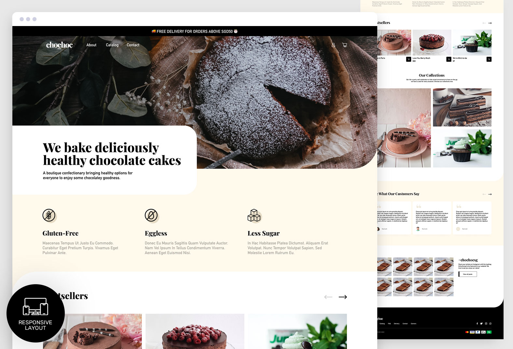

# chochoc

On my quest to polish up my web designing skills, this is the first of a list of prompts.

Chochoc is an imaginary cake shop that caters to customers who are looking for healthy options. The shop sells gluten-free, eggless and less sweet chocolate cakes.

The theme has to be modern, bold and decadent with a friendly tone.

The four main pages done up for the UI portion are the landing page, category page, cake info page and cart.

Only the landing page has been done up as a front-end prototype.

[View landing page prototype](https://nsy-chochocsg.netlify.app/)
